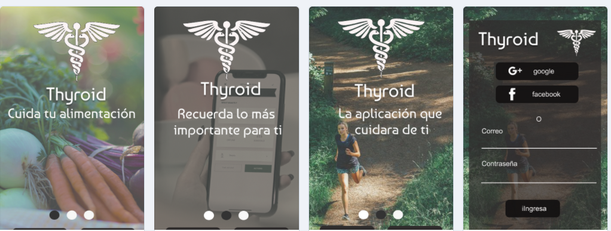
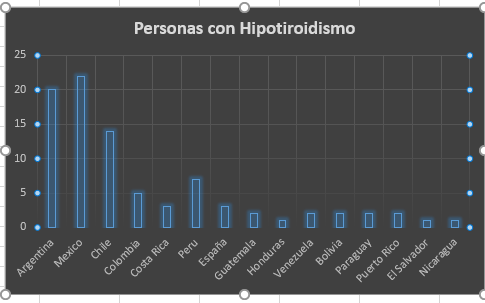
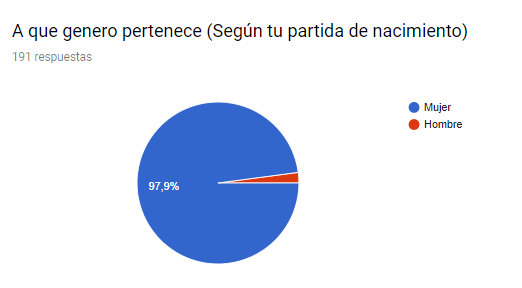
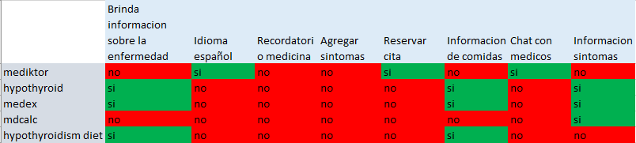
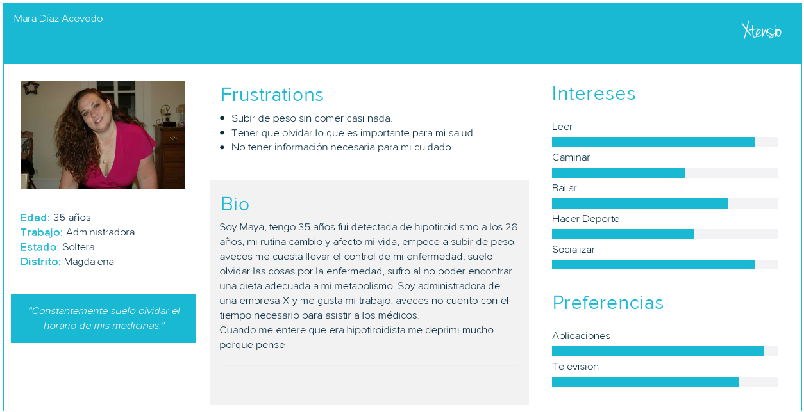

# Thyroid
¿Sufres de Hipotiroidismo?¿Olvidas tomar tu medicina a la hora? Thyroid nació con la finalidad de ayudar a todas las personas que sufren de está enfermedad, nosotros pensamos en ti porque tu salud es muy importante.
 

### Desarrollado para
[Laboratoria](http://www.laboratoria.la/)

- Track: Common Core.
- Unidad: Primer proyecto Ux.

### Reto
Diseñar un producto digital que resuelva una necesidad. Si tienes una idea de un producto que te gustaría probar, lo podrás hacer. Podrás identificar y conocer a tus usuarios y hacer las pruebas necesarias para poder validar tu idea.

### Propuesta
Thyroid surgio de una necesidad muy grande, El Hipotiroidismo es una enfermedad que se caracteriza por el descenso de secreción de hormonas tiroideas T3-T4; que provoca disminución del metabolismo basal, cansancio, sensibilidad al frío, en la mujer, alteraciones menstruales y que viene acompañado de un aumento de la TSH (hormona estimulante de la tiroides).
Segun la investigacion realizada descubrimos que hay una gran cantidad de personas que sufren de está enfermedad y que quizas no cuentan con la informacion detallada. Es por esto que surge la idea de Thyroid para lograr atacar ese problema. 

### Prototipo Propuesto
 

### Usuarios finales
- Personas que sufran de Hipotiroidismo

### Stakeholders
- Medicos (Endocrinologos).
- Usuarios.
- Nutricionista
- Psicologos 

### Reunión kick-off
* Entrevistas a los medicos (Endocrinologo)
1. ¿Que sintomas presenta una persona X para poder saber si tiene Hipotiroidismo?
- Fatiga
- Aumento de peso
- Hinchazón de la cara
- Intolerancia al frío
- Dolor en las articulaciones y los músculos
- Estreñimiento
- Piel seca
- Cabello fino y seco
- Disminución de la sudoración
- Períodos menstruales abundantes o irregulares y problemas de fertilidad
- Depresión
- Disminución del ritmo cardiaco
Eston son los principales sintomas, sin embargo segun las personas pueden presentar otros
2. ¿Cuales son los examenes o analisis que deben realizar para saber si sufro de Hipotiroidismo?
- Prueba de tiroxina (T4) 
- Prueba de TSH  
- Pruebas y exámenes para la tiroides
3. Que datos deberia registrar principalmente en una aplicacion para personas que sufren de hipotiroidismo
- Nombre Completo
- Edad
- Talla
- Edad
- Si sufres de alguna otra enfermedad
4. ¿Esta enfermedad se presenta más en hombres o mujeres?
- Se presenta más en mujeres, de cada 10 chicas con hipotiroidismo hay 1 hombre que lo presenta.
5. ¿Tiene cura esta enfermedad?
- No, por ahora no, pero tiene tratamiento.
6. Me podria explicar cual es el tratamiento
- Tomar pastillas, por ejemplo a una paciente recien medicada fue
- levotiroxina 100 MG todos los días. Luego lunes, miércoles y viernes 75 MG . Martes, jueves, sábados y domingos 50 MG.
* Entrevistas a los medicos (Nutricionista)
1. ¿Una persona que sufre de hipotiroidismo debe cambiar su habito alimenticio?
- Si, ellos deben de seguir una dieta baja en azucar
2. ¿Que es lo que no pueden comer?
- Lo recomendable es que no coman mucho de comida procesada, que bajen el nivel de azucar, tampoco Gluten, ni cafe y de preferencia dejar de fumar o tomar.

### Preguntas Propuestas para los usuarios
- 1.- ¿Sufres de Hipotiroidismo?
- 2.- Si respondiste que no, ¿Conoces a alguien que padezca de esta enfermedad?
- 3.- A los cuantos años te/le detectaron el hipotiroidismo
- 4.- ¿Cuales fueron los síntomas que presentaste?
- 5.- ¿Que tipos de exámenes te hicieron para detectar la enfermedad? (Cuéntanos cuales si los recuerdas)
- 6.- ¿Que tipo de hipotiroidismo te detectaron? (Primario - Secundario - Terciario) Si no sabes el termino cuéntanos como se te presento. 
- 7.- ¿ Que tratamiento debes seguir?
- 8.- ¿El padecer de esta enfermedad afecto tu rutina diaria?
- 9.- ¿Te cuesta seguir el tratamiento? Cuéntanos ¿por que? 
- 10.- ¿Te gustaría estar en constante comunicación con un especialista para resolver alguna duda que pueda surgir ? 
- 11.- ¿El sufrir de Hipotiroidismo afecto en algo mas a tu salud o eres propenso a sufrir alguna otra enfermedad?
- 12.- ¿que síntomas o que molestias tuviste al dejar de tomar la medicina?
- 13.- Si existiese una aplicación que te ayude, que te gustaría que tenga

### Analis de las informacion obtenida
[datos](https://docs.google.com/spreadsheets/d/1rLEWvbLGZ01sTcJViUF8-cArZW_BIe8OVAE28qRkSjE/edit?usp=sharing)
* Paises de los Usuarios testeados que sufren de hipotiroidismo

* Segun las encuestas vimos que 

### Benchmarking
 

### User Persona

### CONCLUSIONES
La aplicacion propuesta se puede utilizar tanto en IOS o android pero el prototipo esta en IOS
La aplicacion trata de que una persona que sufre de hipotiroidismo tenga la facilidad y ayuda con esta, que le recuerde su medicina es el principal objetivo, que le de una dieta personalizada y tambien que pueda hablar con un medico si le surge algun duda o siente que esta mal animicamente.

